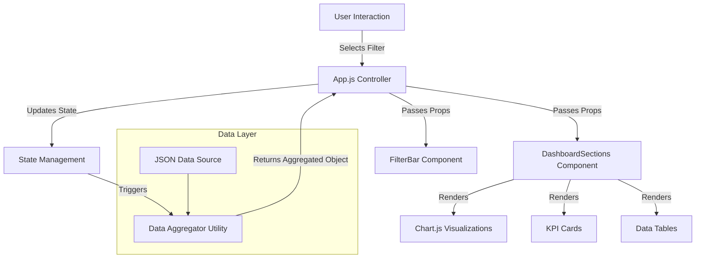

# MedPlus Customer Dashboard | Technical Documentation

**Version:** 2.0.0  
**Status:** Production Ready  
**Last Updated:** December 2025

---

## 1. Executive Summary
The **MedPlus Customer Dashboard** is an enterprise-grade analytics platform designed to empower stakeholders with actionable insights into sales performance, customer retention, and operational efficiency. By leveraging a hierarchical data model and real-time client-side aggregation, the application provides instant visibility into key performance indicators (KPIs) across multiple organizational levels—from State to individual Managers.

The platform features a bespoke "Indigo & Slate" design system, ensuring a premium, accessible, and responsive user experience across all devices.

---

## 2. System Architecture

The application follows a **Component-Based Architecture** powered by React.js, utilizing a unidirectional data flow.



### 2.1 Core Technologies
*   **Frontend Framework**: React 18 (Functional Components, Hooks)
*   **State Management**: React Context / Local State (useState, useMemo)
*   **Visualization Engine**: Chart.js with React-Chartjs-2 wrapper
*   **Styling Engine**: CSS Variables (Custom Properties) & React Bootstrap Grid
*   **Build Tool**: Create React App (Webpack/Babel)

---

## 3. Data Model & Schema

The application consumes a hierarchical JSON dataset designed for efficient client-side traversal.

### 3.1 Hierarchy Definition
The data is structured as a nested dictionary to allow O(1) access times for specific nodes.

```json
{
  "StateName": {
    "AreaName": {
      "supervisor": "String (Name)",
      "supervisorId": "String (ID)",
      "manager": "String (Name)",
      "managerId": "String (ID)",
      "kpis": {
        "revenue": "Number",
        "invoices": "Number",
        "activeUsers": "Number"
      },
      "customerRetention": { ... },
      "trendPanel": { ... }
    }
  }
}
```

### 3.2 Aggregation Logic (`src/utils/dataAggregator.js`)
The `aggregateAreas` function is the core computational engine. It performs the following operations:
1.  **Deep Cloning**: Creates a safe copy of the template structure.
2.  **Vector Addition**: Sums KPI metrics across all selected areas.
3.  **Array Reduction**: Merges time-series data (e.g., Monthly Revenue) by index.
4.  **Cohort Synthesis**: Calculates weighted averages for retention percentages across multiple cohorts.

---

## 4. Component Reference

### 4.1 `App.js` (Root Controller)
Acts as the single source of truth for the application state.
*   **Responsibilities**:
    *   Maintains filter state (`selectedState`, `selectedArea`, etc.).
    *   Memoizes derived lists (e.g., list of Supervisors for the current State).
    *   Orchestrates data flow between the Aggregator and UI components.

### 4.2 `DashboardSections.js` (Presentation Layer)
A pure presentational component responsible for rendering the visualized data.
*   **Props**:
    *   `data`: The fully aggregated data object.
    *   `selectedState`: Used for conditional rendering (e.g., Confetti effects).
*   **Sub-components**:
    *   `Bar` (Revenue Trends)
    *   `Line` (MAU/DAU)
    *   `Doughnut` (Segmentation)

### 4.3 `FilterBar.js` (Control Layer)
Provides the interface for data slicing.
*   **Features**:
    *   **Context Awareness**: Disables "Area" dropdown until a "State" is selected.
    *   **Custom UI**: Replaces native `<select>` with styled `Dropdown` components for brand consistency.

---

## 5. Design System Specifications

The UI is built upon a strict set of design tokens defined in `src/styles/dashboard.css`.

### 5.1 Color Theory
| Token | Hex Value | Usage |
|-------|-----------|-------|
| `--primary-color` | `#4f46e5` | Primary actions, active states, key data points |
| `--surface-color` | `#ffffff` | Card backgrounds, modal windows |
| `--background-color` | `#f8fafc` | Global application background |
| `--text-secondary` | `#64748b` | Labels, secondary metadata |

### 5.2 Typography
*   **Display Font**: `Outfit` (Weights: 500, 600, 700) - Used for KPIs and Section Headers.
*   **Body Font**: `Inter` (Weights: 400, 500) - Used for tables, charts, and controls.

---

## 6. Development Standards

### 6.1 Code Style
*   **Functional Programming**: Prefer pure functions for logic (e.g., aggregators).
*   **Hooks Pattern**: Use `useMemo` for expensive calculations to ensure 60fps rendering.
*   **Component Composition**: Break down complex UIs into smaller, reusable atoms.

### 6.2 Performance Optimization
*   **Memoization**: The `areas`, `supervisors`, and `managers` lists are memoized to prevent unnecessary recalculations during re-renders.
*   **Lazy Evaluation**: Data aggregation only runs when filter dependencies change.

---

## 7. Setup & Deployment

### 7.1 Local Development Environment
```bash
# Clone repository
git clone <repo-url>

# Install dependencies
npm install

# Start development server (Hot Reloading enabled)
npm start
```

### 7.2 Production Build
The application is optimized for static hosting (S3, Vercel, Netlify).
```bash
# Generate production bundle
npm run build
```
*Output*: A minified, tree-shaken `build/` directory ready for deployment.

---

**Confidentiality Notice**: This software and its documentation are proprietary to MedPlus. Unauthorized distribution is strictly prohibited.
